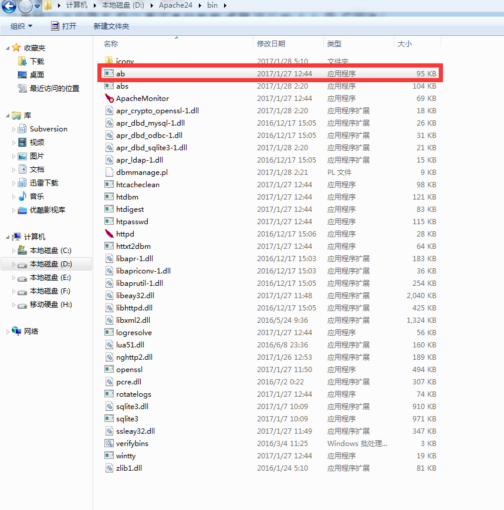
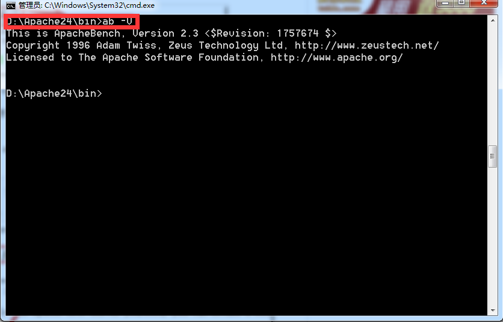

# apache性能测试工具ab使用说明

## 一、ab的原理

ab是apachebench命令的缩写。

ab的原理：ab命令会创建多个并发访问线程，模拟多个访问者同时对某一URL地址进行访问。它的测试目标是基于URL的，因此，它既可以用来测试apache的负载压力，也可以测试nginx、lighthttp、tomcat、IIS等其它Web服务器的压力。

ab命令对发出负载的计算机要求很低，它既不会占用很高CPU，也不会占用很多内存。但却会给目标服务器造成巨大的负载，其原理类似CC攻击。自己测试使用也需要注意，否则一次上太多的负载。可能造成目标服务器资源耗完，严重时甚至导致死机。

## 二、ab的安装

ab的安装非常简单，如果是源码安装apache的话，那就更简单了。apache安装完毕后ab命令存放在apache安装目录的bin目录下。如下图所示:

如果ab安装成功，通过ab –V命令则会显示ab的相应的版本号，如下图所示：

## 三、ab参数说明

有关ab命令的使用，我们可以通过帮助命令进行查看。如下：

下面我们对这些参数，进行相关说明。如下：

-n 在测试会话中所执行的请求个数。默认时，仅执行一个请求。

-c 一次产生的请求个数。默认是一次一个。

-t 测试所进行的最大秒数。其内部隐含值是-n 50000，它可以使对服务器的测试限制在一个固定的总时间以内。默认时，没有时间限制。

-p 包含了需要POST的数据的文件。

-P 对一个中转代理提供BASIC认证信任。用户名和密码由一个:隔开，并以base64编码形式发送。无论服务器是否需要(即, 是否发送了401认证需求代码)，此字符串都会被发送。

-T POST数据所使用的Content-type头信息。

-v 设置显示信息的详细程度-4或更大值会显示头信息，3或更大值可以显示响应代码(404,200等),2或更大值可以显示警告和其他信息。

-V 显示版本号并退出。

-w 以HTML表的格式输出结果。默认时，它是白色背景的两列宽度的一张表。

-i 执行HEAD请求，而不是GET。

-x 设置<table>属性的字符串。

-X 对请求使用代理服务器。

-y 设置<tr>属性的字符串。

-z 设置<td>属性的字符串。

-C 对请求附加一个Cookie:行。其典型形式是name=value的一个参数对，此参数可以重复。

-H 对请求附加额外的头信息。此参数的典型形式是一个有效的头信息行，其中包含了以冒号分隔的字段和值的对(如,"Accept-Encoding:zip/zop;8bit")。

-A 对服务器提供BASIC认证信任。用户名和密码由一个:隔开，并以base64编码形式发送。无论服务器是否需要(即,是否发送了401认证需求代码)，此字符串都会被发送。

-h 显示使用方法。

-d 不显示"percentage served within XX [ms] table"的消息(为以前的版本提供支持)。

-e 产生一个以逗号分隔的(CSV)文件，其中包含了处理每个相应百分比的请求所需要(从1%到100%)的相应百分比的(以微妙为单位)时间。由于这种格式已经“二进制化”，所以比'gnuplot'格式更有用。

-g 把所有测试结果写入一个'gnuplot'或者TSV(以Tab分隔的)文件。此文件可以方便地导入到Gnuplot,IDL,Mathematica,Igor甚至Excel中。其中的第一行为标题。

-i 执行HEAD请求，而不是GET。

-k 启用HTTP KeepAlive功能，即在一个HTTP会话中执行多个请求。默认时，不启用KeepAlive功能。

-q 如果处理的请求数大于150，ab每处理大约10%或者100个请求时，会在stderr输出一个进度计数。此-q标记可以抑制这些信息。

## 四、ab性能指标

在进行性能测试过程中有几个指标比较重要：

1、吞吐率（Requests per second）

服务器并发处理能力的量化描述，单位是reqs/s，指的是在某个并发用户数下单位时间内处理的请求数。某个并发用户数下单位时间内能处理的最大请求数，称之为最大吞吐率。

记住：吞吐率是基于并发用户数的。这句话代表了两个含义：

a、吞吐率和并发用户数相关

b、不同的并发用户数下，吞吐率一般是不同的

计算公式：总请求数/处理完成这些请求数所花费的时间，即

Request per second=Complete requests/Time taken for tests

必须要说明的是，这个数值表示当前机器的整体性能，值越大越好。

2、并发连接数（The number of concurrent connections）

并发连接数指的是某个时刻服务器所接受的请求数目，简单的讲，就是一个会话。

3、并发用户数（Concurrency Level）

要注意区分这个概念和并发连接数之间的区别，一个用户可能同时会产生多个会话，也即连接数。在HTTP/1.1下，IE7支持两个并发连接，IE8支持6个并发连接，FireFox3支持4个并发连接，所以相应的，我们的并发用户数就得除以这个基数。

4、用户平均请求等待时间（Time per request）

计算公式：处理完成所有请求数所花费的时间/（总请求数/并发用户数），即：

Time per request=Time taken for tests/（Complete requests/Concurrency Level）

5、服务器平均请求等待时间（Time per request:across all concurrent requests）

计算公式：处理完成所有请求数所花费的时间/总请求数，即：

Time taken for/testsComplete requests

可以看到，它是吞吐率的倒数。

同时，它也等于用户平均请求等待时间/并发用户数，即

Time per request/Concurrency Level

我们现在就来测试apache的性能。使用如下命令：

ab -n 1000 -c 100 http://www.jb51.net/ 

-c 10表示并发用户数为10

-n100表示请求总数为100

http://www.jb51.net/表示请求的目标URL

运行结果如下：

D:\Apache24\bin>ab -n 10 -c 10 http://www.jb51.net/

This is ApacheBench, Version 2.3 <$Revision: 655654 $>

Copyright 1996 Adam Twiss, Zeus Technology Ltd, http://www.zeustech.net/

Licensed to The Apache Software Foundation, http://www.apache.org/
Benchmarking www.jb51.net (be patient)…..done

Server Software:        Microsoft-IIS/6.0  //Microsoft-IIS服务器版本6.0

Server Hostname:        www.jb51.net  //服务器主机名

Server Port:            80  //服务器端口
Document Path:          /  //测试的页面文档

Document Length:        32639 bytes  //文档大小
Concurrency Level:      10  //并发数

Time taken for tests:   13.548 seconds  //整个测试持续的时间

Complete requests:      10  //完成的请求数量

Failed requests:        0  //失败的请求数量

Write errors:           0

Total transferred:      331070 bytes  //整个场景中的网络传输量

HTML transferred:       326390 bytes  //整个场景中的HTML内容传输量

Requests per second:    0.74 [#/sec] (mean)  //每秒事务数 ，后面括号中的 mean 表示这是一个平均值

Time per request:       13547.775 [ms] (mean)  //平均事务响应时间 ，后面括号中的 mean 表示这是一个平均值

Time per request:       1354.777 [ms] (mean, across all concurrent requests)  //每个请求实际运行时间的平均值

Transfer rate:          23.86 [Kbytes/sec] received  //平均每秒网络上的流量，可以帮助排除是否存在网络流量过大导致响应时间延长的问题
Connection Times (ms)  //网络上消耗的时间的分解

min  mean[+/-sd] median   max

Connect:        1    2   0.8      2       3

Processing:  2163 3981 3420.2   2957   13540

Waiting:     1305 3204 3595.3   2096   13169

Total:       2164 3983 3420.0   2959   13541

//以下是整个场景中所有请求的响应情况。在场景中每个请求都有一个响应时间，其中50％的用户响应时间小于2959毫秒，66％ 的用户响应时间小于3074毫秒，最大的响应时间小于13541 毫秒。由于对于并发请求，cpu实际上并不是同时处理的，而是按照每个请求获得的时间片逐个轮转处理的，所以基本上第一个Time per request时间约等于第二个Time per request时间乘以并发请求数。

Percentage of the requests served within a certain time (ms)

  50%   2959

  66%   3074

  75%   3974

  80%   4008

  90%  13541

  95%  13541

  98%  13541

  99%  13541

 100%  13541 (longest request)